# PRD: TV Bingo

> **Version:** 1.0  
> **Last Updated:** 2025-01-24  
> **Status:** Draft  
> **Owner:** bomartin

---

## Table of Contents

1. [Executive Summary](#1-executive-summary)
2. [Goals & Success Metrics](#2-goals--success-metrics)
3. [Target Audience](#3-target-audience)
4. [Technical Foundation](#4-technical-foundation)
5. [Architecture Overview](#5-architecture-overview)
6. [Data Model](#6-data-model)
7. [API Contracts](#7-api-contracts)
8. [User Flows](#8-user-flows)
9. [Story Dependency Graph](#9-story-dependency-graph)
10. [User Stories](#10-user-stories)
11. [Technical Glossary](#11-technical-glossary)
12. [Security Considerations](#12-security-considerations)
13. [Future Considerations](#13-future-considerations)

---

## 1. Executive Summary

### 1.1 Problem Statement

Watching TV shows with friends and family is a beloved social activity, but it can lack interactive engagement. Fans of TV shows often notice recurring phrases, catchphrases, tropes, and predictable moments, but there's no easy way to turn this into a fun, shared experience. Existing bingo apps are generic and don't cater to the specific needs of TV show enthusiasts who want customizable, show-specific bingo cards.

### 1.2 Proposed Solution

TV Bingo is a free web application that allows users to create custom bingo cards for any TV show. Users define common phrases, catchphrases, and recurring moments for their favorite shows, then generate randomized 5x5 bingo cards to play while watching. The app detects winning combinations (rows, columns, diagonals) and celebrates victories, making TV watching more engaging and social.

### 1.3 Scope

**In Scope (v1.0 - Current Baseline):**
- TV show management (create, read, update, delete)
- Phrase management for each show (minimum 24 phrases required)
- Randomized 5x5 bingo card generation
- Interactive cell selection during gameplay
- Win detection for rows, columns, and diagonals
- Visual celebration when bingo is achieved
- Seed data with popular TV shows (Survivor, The Office, Friends, etc.)

**In Scope (v1.1 - Planned Improvements):**
- Migrate frontend from IndexedDB to REST API
- User authentication (registered users vs. guests)
- Phrase validation (50 character max, duplicate detection)
- Bulk phrase import via CSV
- Shareable show links
- UI/UX visual design improvements
- Navigation flow improvements
- Mobile responsiveness enhancements

**Out of Scope:**
- Game state persistence (game resets on navigation)
- Multiplayer/real-time collaborative play
- Mobile native apps (iOS/Android)
- Monetization features
- Social media integration
- Show moderation/approval workflow
- Offline mode support

---

## 2. Goals & Success Metrics

| Goal | Metric | Target |
|------|--------|--------|
| Functional Application | All CRUD operations work correctly | 100% test pass rate |
| Playable Experience | Users can generate and play bingo cards | Card generation < 500ms |
| Data Integrity | No data loss or corruption | Zero data integrity issues |
| API Migration | Frontend uses REST API instead of IndexedDB | 100% API coverage |
| User Experience | Intuitive navigation and visual design | Qualitative user feedback |

> Note: This is a passion project focused on building a useful, functional app rather than growth metrics.

---

## 3. Target Audience

### 3.1 Primary Users

**TV Enthusiasts ("Players")**
- People who watch TV shows with friends and family
- Enjoy interactive, game-like experiences while watching
- Range from casual viewers to dedicated fans
- May use the app at watch parties, viewing clubs, or casual home viewing
- Technical comfort level: Basic (can navigate web apps)

### 3.2 Secondary Users

**Content Creators ("Show Managers")**
- Users who create and curate TV show content
- May be trivia night organizers or watch party hosts
- Want to customize bingo cards for specific episodes or show seasons
- Technical comfort level: Intermediate (comfortable with forms and data entry)
- Note: In v1.1+, this role requires registration; guests can only play

---

## 4. Technical Foundation

### 4.1 Global Tech Stack

> These are the default technologies. Individual stories may override specific choices.

| Layer | Technology | Version | Notes |
|-------|------------|---------|-------|
| **Backend Language** | Java | 21 | LTS version |
| **Backend Framework** | Spring Boot | 3.5.x | With Spring Data JDBC |
| **Frontend Language** | TypeScript | 5.x | Strict mode enabled |
| **Frontend Framework** | Vue.js | 3.5.x | Composition API with `<script setup>` |
| **Build Tool (Backend)** | Gradle | 8.x | Wrapper included |
| **Build Tool (Frontend)** | Vite | 5.x | Fast dev server and builds |
| **Database** | PostgreSQL | 15+ | Supabase hosted (production) |
| **Database Migrations** | Liquibase | 4.x | YAML format |
| **API Style** | REST | - | JSON payloads |
| **API Documentation** | OpenAPI/Swagger | 3.0 | SpringDoc integration |
| **Authentication** | Supabase Auth | - | Planned for v1.1 |

### 4.2 Development Standards

| Aspect | Standard |
|--------|----------|
| **Code Style (Java)** | Standard Java conventions with Lombok |
| **Code Style (TypeScript)** | ESLint + Prettier defaults |
| **Branch Strategy** | Feature branches with main as default |
| **Commit Convention** | Conventional Commits recommended |
| **PR Requirements** | Tests passing, builds successfully |
| **Testing (Backend)** | JUnit 5, Embedded Postgres for integration tests |
| **Testing (Frontend)** | Vitest (planned) |

### 4.3 Project Structure

```
tv-bingo/
├── spring-tvbingo/                    # Backend application
│   ├── src/
│   │   ├── main/
│   │   │   ├── java/org/bomartin/tvbingo/
│   │   │   │   ├── config/            # Spring configuration (CORS, etc.)
│   │   │   │   ├── controller/        # REST controllers
│   │   │   │   ├── dto/               # Data Transfer Objects
│   │   │   │   ├── exception/         # Global exception handling
│   │   │   │   ├── model/             # Domain entities
│   │   │   │   ├── repository/        # Data access layer
│   │   │   │   ├── service/           # Business logic
│   │   │   │   └── validation/        # Custom validators
│   │   │   └── resources/
│   │   │       ├── db/changelog/      # Liquibase migrations
│   │   │       ├── application.yml    # Main config
│   │   │       └── openapi.yaml       # API specification
│   │   └── test/
│   │       ├── java/org/bomartin/tvbingo/
│   │       │   ├── repository/        # Repository tests
│   │       │   └── service/           # Service tests
│   │       └── resources/
│   │           ├── application-test.yml
│   │           └── test-schema.sql
│   └── build.gradle
├── vue-tvbingo/                       # Frontend application
│   ├── src/
│   │   ├── assets/                    # Static assets and mock data
│   │   ├── components/                # Reusable UI components
│   │   │   ├── CreateShow.vue
│   │   │   ├── ShowDetail.vue
│   │   │   └── ShowsList.vue
│   │   ├── pages/                     # Page-level components
│   │   │   ├── BingoCard.vue
│   │   │   └── CreateShowPage.vue
│   │   ├── router/                    # Vue Router configuration
│   │   ├── services/                  # API client services
│   │   ├── types/                     # TypeScript type definitions
│   │   ├── App.vue
│   │   └── main.ts
│   ├── doc/                           # Documentation and diagrams
│   ├── package.json
│   └── tsconfig.json
└── README.md
```

### 4.4 Naming Conventions

| Element | Convention | Example |
|---------|------------|---------|
| **Java Classes** | PascalCase | `ShowService`, `ShowController` |
| **Java Methods** | camelCase | `getShowById()`, `createShow()` |
| **Vue Components** | PascalCase files | `ShowsList.vue`, `BingoCard.vue` |
| **TypeScript Interfaces** | PascalCase | `Show`, `CreateShowInput` |
| **TypeScript Files** | PascalCase for components, camelCase for services | `showService.ts` |
| **Database Tables** | snake_case, plural | `shows`, `users` |
| **Database Columns** | snake_case | `show_title`, `center_square` |
| **API Endpoints** | kebab-case, plural nouns | `/api/shows` |
| **Environment Variables** | SCREAMING_SNAKE_CASE | `TVBINGO_DB_URL` |

---

## 5. Architecture Overview

### 5.1 Current System Architecture (v1.0)


### 5.2 Target System Architecture (v1.1)


### 5.3 Component Descriptions

| Component | Purpose | Technology |
|-----------|---------|------------|
| **Web App** | User interface for show management and bingo gameplay | Vue 3, TypeScript, Vite |
| **REST API** | Business logic and data persistence | Spring Boot 3.5, Spring Data JDBC |
| **PostgreSQL** | Primary data store for shows and phrases | PostgreSQL 15+ (Supabase) |
| **Supabase Auth** | User authentication and session management (planned) | Supabase Auth with JWT |

---

## 6. Data Model

### 6.1 Entity Relationship Diagram


### 6.2 Entity Definitions

#### SHOWS (Current - Implemented)

| Field | Type | Constraints | Description |
|-------|------|-------------|-------------|
| `id` | BIGSERIAL | PK, NOT NULL, AUTO_INCREMENT | Unique identifier |
| `show_title` | VARCHAR(255) | UK, NOT NULL | Title of the TV show |
| `game_title` | VARCHAR(255) | NULLABLE | Optional alternate game name |
| `center_square` | VARCHAR(255) | NULLABLE | Text for the free center square |
| `phrases` | TEXT[] | NULLABLE | Array of bingo phrases |

**Indexes:**
- `idx_shows_show_title` on `show_title`
- `uk_shows_show_title` unique constraint on `show_title`

#### USERS (Planned - v1.1)

| Field | Type | Constraints | Description |
|-------|------|-------------|-------------|
| `id` | UUID | PK, NOT NULL | Unique identifier (from Supabase) |
| `email` | VARCHAR(255) | UK, NOT NULL | User's email address |
| `display_name` | VARCHAR(100) | NULLABLE | User's display name |
| `created_at` | TIMESTAMP | NOT NULL, DEFAULT NOW() | Account creation time |
| `updated_at` | TIMESTAMP | NOT NULL | Last update time |

---

## 7. API Contracts

### 7.1 API Versioning

Current API does not use versioning: `/api/shows`

Future versions may adopt: `/api/v1/shows`

### 7.2 Standard Response Format

**Success Response (Single Entity):**
```json
{
  "id": 1,
  "showTitle": "Survivor",
  "gameTitle": "Got Nothing For Ya",
  "centerSquare": "This is Survivor",
  "phrases": ["Bring me your torch", "Come on in, guys!", "..."]
}
```

**Success Response (Collection):**
```json
[
  {
    "id": 1,
    "showTitle": "Survivor",
    "gameTitle": "Got Nothing For Ya",
    "centerSquare": "This is Survivor",
    "phrases": ["..."]
  },
  {
    "id": 2,
    "showTitle": "The Office",
    "gameTitle": "That's What She Said",
    "centerSquare": "Michael Scott Quote",
    "phrases": ["..."]
  }
]
```

**Error Response (Validation):**
```json
{
  "showTitle": "Show title is required"
}
```

**Error Response (Conflict):**
```json
{
  "showTitle": "Show title must be unique"
}
```

### 7.3 Endpoint Definitions

#### GET /api/shows

**Purpose:** Retrieve all TV shows

**Request:** None

**Response (200 OK):**
```json
[
  {
    "id": 1,
    "showTitle": "Survivor",
    "gameTitle": "Got Nothing For Ya",
    "centerSquare": "This is Survivor",
    "phrases": ["Bring me your torch", "Come on in, guys!"]
  }
]
```

---

#### POST /api/shows

**Purpose:** Create a new TV show

**Request:**
```json
{
  "showTitle": "Breaking Bad",
  "gameTitle": "Say My Name",
  "centerSquare": "I am the danger",
  "phrases": ["Say my name", "Yeah science!", "I am the one who knocks"]
}
```

**Response (201 Created):**
```json
{
  "id": 8,
  "showTitle": "Breaking Bad",
  "gameTitle": "Say My Name",
  "centerSquare": "I am the danger",
  "phrases": ["Say my name", "Yeah science!", "I am the one who knocks"]
}
```

**Error Codes:**
| Code | HTTP Status | Description |
|------|-------------|-------------|
| `showTitle: Show title is required` | 400 | Show title is blank |
| `showTitle: Show title must be unique` | 409 | Duplicate show title |

---

#### GET /api/shows/{id}

**Purpose:** Retrieve a specific TV show by ID

**Request:** Path parameter `id` (Long)

**Response (200 OK):**
```json
{
  "id": 1,
  "showTitle": "Survivor",
  "gameTitle": "Got Nothing For Ya",
  "centerSquare": "This is Survivor",
  "phrases": ["Bring me your torch", "Come on in, guys!"]
}
```

**Error Codes:**
| Code | HTTP Status | Description |
|------|-------------|-------------|
| - | 404 | Show not found with id: {id} |

---

#### PUT /api/shows/{id}

**Purpose:** Update an existing TV show

**Request:**
```json
{
  "showTitle": "Survivor: Heroes vs Villains",
  "gameTitle": "Got Nothing For Ya",
  "centerSquare": "This is Survivor",
  "phrases": ["Bring me your torch", "Come on in, guys!", "New phrase"]
}
```

**Response (200 OK):**
```json
{
  "id": 1,
  "showTitle": "Survivor: Heroes vs Villains",
  "gameTitle": "Got Nothing For Ya",
  "centerSquare": "This is Survivor",
  "phrases": ["Bring me your torch", "Come on in, guys!", "New phrase"]
}
```

**Error Codes:**
| Code | HTTP Status | Description |
|------|-------------|-------------|
| `showTitle: Show title is required` | 400 | Show title is blank |
| `showTitle: Show title must be unique` | 400/409 | Another show has this title |
| - | 404 | Show not found with id: {id} |

---

#### DELETE /api/shows/{id}

**Purpose:** Delete a TV show

**Request:** Path parameter `id` (Long)

**Response (204 No Content):** Empty body

**Error Codes:**
| Code | HTTP Status | Description |
|------|-------------|-------------|
| - | 404 | Show not found with id: {id} |

---

## 8. User Flows

### 8.1 Page Navigation Flow

```mermaid
flowchart TD
    HOME["Home Page<br/>(Shows List)"]
    CREATE["Create Show Page"]
    EDIT["Edit Show Page"]
    PLAY["Bingo Card Page"]
    
    HOME -->|"Click '+ Add Show'"| CREATE
    HOME -->|"Click Show Card"| PLAY
    HOME -->|"Click Edit Button"| EDIT
    
    CREATE -->|"Submit new show"| HOME
    CREATE -->|"Cancel"| HOME
    
    EDIT -->|"Save changes"| HOME
    EDIT -->|"Cancel"| HOME
    
    PLAY -->|"Click Show Title"| EDIT
    PLAY -->|"Click '← Back to Shows'"| HOME
    
    style HOME fill:#9c27b0,color:#fff
    style CREATE fill:#4CAF50,color:#fff
    style EDIT fill:#2196F3,color:#fff
    style PLAY fill:#FFC107,color:#000
```



### 8.2 Bingo Card Generation Flow


### 8.3 Show CRUD Flow (Current - IndexedDB)


### 8.4 Show CRUD Flow (Target - REST API)


---

## 9. Story Dependency Graph


**Legend:**
- 🟩 Green: Done
- 🟨 Yellow: In Progress
- ⬜ White: Not Started

---

## 10. User Stories

---

### Epic: API Migration

---

### US-001: Create API Service Layer in Frontend

| Attribute | Value |
|-----------|-------|
| **Status** | `Not Started` |
| **Type** | `Frontend` |
| **Estimated Effort** | ~2 hours |
| **Epic** | API Migration |
| **Priority** | P0 (Critical) |

#### Description

As a developer, I want a centralized API service layer in the frontend so that all components can communicate with the REST API consistently.

#### Prerequisites

| Story ID | Title | Status |
|----------|-------|--------|
| — | No prerequisites | — |

#### Acceptance Criteria

- [ ] AC1: New `apiService.ts` file exists with base configuration
- [ ] AC2: Service includes typed methods for all show operations (GET, POST, PUT, DELETE)
- [ ] AC3: Error handling is consistent across all methods
- [ ] AC4: Base URL is configurable via environment variable
- [ ] AC5: Service exports TypeScript types matching API contracts

#### Technical Specifications

**Implementation Details:**
```typescript
// src/services/apiService.ts
const API_BASE_URL = import.meta.env.VITE_API_URL || 'http://localhost:8080';

export const apiService = {
  async getShows(): Promise<Show[]> { ... },
  async getShowById(id: number): Promise<Show> { ... },
  async createShow(show: CreateShowInput): Promise<Show> { ... },
  async updateShow(show: Show): Promise<Show> { ... },
  async deleteShow(id: number): Promise<void> { ... },
};
```

#### Agent Instructions

**🎯 Objective:**
Create a new API service layer that wraps fetch calls to the REST API with proper typing and error handling.

**📁 Files to Create/Modify:**
| Action | File Path | Purpose |
|--------|-----------|---------|
| CREATE | `vue-tvbingo/src/services/apiService.ts` | New API client service |
| CREATE | `vue-tvbingo/.env.example` | Environment variable template |
| MODIFY | `vue-tvbingo/src/types/Show.ts` | Add API error types if needed |

**🚫 Constraints:**
- DO NOT modify `showService.ts` yet (separate story)
- DO NOT remove IndexedDB code yet
- DO NOT add authentication headers yet

**💡 Hints:**
- Use native `fetch` API (no axios dependency needed)
- Consider a wrapper function for common error handling
- Use generics for type-safe responses

**📖 Reference Files:**
- `vue-tvbingo/src/services/showService.ts` - Current service pattern
- `spring-tvbingo/src/main/resources/openapi.yaml` - API contract

**📤 Expected Output:**
- [ ] `apiService.ts` with all CRUD methods
- [ ] `.env.example` with `VITE_API_URL` variable
- [ ] Code compiles with no TypeScript errors

#### Testing Requirements

**Frontend:**
- [ ] Unit tests for each API method (mock fetch)
- [ ] Error handling tests for 400, 404, 409, 500 responses

**Test File Locations:**
| Test Type | Location |
|-----------|----------|
| Unit | `vue-tvbingo/src/services/__tests__/apiService.test.ts` |

#### Definition of Done

- [ ] All acceptance criteria met
- [ ] All tests written and passing
- [ ] Code compiles with no errors
- [ ] No new linting warnings
- [ ] Self-review completed
- [ ] Ready for human code review

---

### US-002: Migrate Shows List to API

| Attribute | Value |
|-----------|-------|
| **Status** | `Not Started` |
| **Type** | `Frontend` |
| **Estimated Effort** | ~1 hour |
| **Epic** | API Migration |
| **Priority** | P0 (Critical) |

#### Description

As a user, I want the shows list to load from the REST API so that I see shows stored in the database.

#### Prerequisites

| Story ID | Title | Status |
|----------|-------|--------|
| US-001 | Create API Service Layer in Frontend | Required |

#### Acceptance Criteria

- [ ] AC1: Shows list component calls `apiService.getShows()` instead of IndexedDB
- [ ] AC2: Loading state displays while fetching
- [ ] AC3: Error state displays if API call fails
- [ ] AC4: Shows display correctly after successful fetch

#### Technical Specifications

**Data Model References:**
- See: [Section 7.3 - GET /api/shows](#get-apishows)

**Implementation Details:**
- Modify `ShowsList.vue` to import and use `apiService`
- Keep existing UI/UX behavior unchanged
- Add retry button on error state

#### Agent Instructions

**🎯 Objective:**
Update the ShowsList component to fetch data from the REST API instead of IndexedDB.

**📁 Files to Create/Modify:**
| Action | File Path | Purpose |
|--------|-----------|---------|
| MODIFY | `vue-tvbingo/src/components/ShowsList.vue` | Use apiService for data fetching |

**🚫 Constraints:**
- DO NOT change the visual design
- DO NOT remove IndexedDB fallback yet (keep showService import as backup)

**💡 Hints:**
- The component already has loading/error states—just change the data source
- Consider logging both services during transition for debugging

**📖 Reference Files:**
- `vue-tvbingo/src/services/apiService.ts` - New API service
- `vue-tvbingo/src/components/ShowsList.vue` - Current implementation

**📤 Expected Output:**
- [ ] ShowsList fetches from API
- [ ] Loading and error states work correctly
- [ ] No visual changes to the UI

#### Testing Requirements

**Frontend:**
- [ ] E2E test: Shows list loads and displays shows from API

**Test File Locations:**
| Test Type | Location |
|-----------|----------|
| E2E | `vue-tvbingo/src/__tests__/e2e/ShowsList.test.ts` |

#### Definition of Done

- [ ] All acceptance criteria met
- [ ] All tests written and passing
- [ ] Code compiles with no errors
- [ ] No new linting warnings
- [ ] Self-review completed
- [ ] Ready for human code review

---

### US-003: Migrate Show Detail/Edit to API

| Attribute | Value |
|-----------|-------|
| **Status** | `Not Started` |
| **Type** | `Frontend` |
| **Estimated Effort** | ~1.5 hours |
| **Epic** | API Migration |
| **Priority** | P0 (Critical) |

#### Description

As a user, I want to edit show details using the REST API so that my changes are persisted to the database.

#### Prerequisites

| Story ID | Title | Status |
|----------|-------|--------|
| US-001 | Create API Service Layer in Frontend | Required |

#### Acceptance Criteria

- [ ] AC1: ShowDetail component loads show via `apiService.getShowById()`
- [ ] AC2: Save button calls `apiService.updateShow()`
- [ ] AC3: Error messages display for validation failures (400)
- [ ] AC4: Error message displays for duplicate title (409)
- [ ] AC5: Success navigates back to home page

#### Technical Specifications

**Data Model References:**
- See: [Section 7.3 - GET /api/shows/{id}](#get-apishowsid)
- See: [Section 7.3 - PUT /api/shows/{id}](#put-apishowsid)

#### Agent Instructions

**🎯 Objective:**
Update the ShowDetail component to load and save data via the REST API.

**📁 Files to Create/Modify:**
| Action | File Path | Purpose |
|--------|-----------|---------|
| MODIFY | `vue-tvbingo/src/components/ShowDetail.vue` | Use apiService for load/save |

**🚫 Constraints:**
- DO NOT change the form layout or fields
- DO NOT add new validation yet (separate story)

**💡 Hints:**
- Handle 409 Conflict separately from 400 Bad Request
- Parse error response body for field-specific messages

**📖 Reference Files:**
- `vue-tvbingo/src/services/apiService.ts` - API service
- `spring-tvbingo/src/main/java/org/bomartin/tvbingo/exception/GlobalExceptionHandler.java` - Error format

**📤 Expected Output:**
- [ ] ShowDetail loads from API
- [ ] ShowDetail saves to API
- [ ] Error messages display appropriately

#### Testing Requirements

**Frontend:**
- [ ] Unit test: Load show by ID
- [ ] Unit test: Update show successfully
- [ ] Unit test: Handle validation error
- [ ] Unit test: Handle conflict error

**Test File Locations:**
| Test Type | Location |
|-----------|----------|
| Unit | `vue-tvbingo/src/components/__tests__/ShowDetail.test.ts` |

#### Definition of Done

- [ ] All acceptance criteria met
- [ ] All tests written and passing
- [ ] Code compiles with no errors
- [ ] No new linting warnings
- [ ] Self-review completed
- [ ] Ready for human code review

---

### US-004: Migrate Create Show to API

| Attribute | Value |
|-----------|-------|
| **Status** | `Not Started` |
| **Type** | `Frontend` |
| **Estimated Effort** | ~1 hour |
| **Epic** | API Migration |
| **Priority** | P0 (Critical) |

#### Description

As a user, I want to create new shows using the REST API so that they are persisted to the database.

#### Prerequisites

| Story ID | Title | Status |
|----------|-------|--------|
| US-001 | Create API Service Layer in Frontend | Required |

#### Acceptance Criteria

- [ ] AC1: CreateShow component calls `apiService.createShow()` on submit
- [ ] AC2: Error messages display for validation failures (400)
- [ ] AC3: Error message displays for duplicate title (409)
- [ ] AC4: Success navigates back to home page
- [ ] AC5: ID is assigned by the server (not client-generated)

#### Technical Specifications

**Data Model References:**
- See: [Section 7.3 - POST /api/shows](#post-apishows)

#### Agent Instructions

**🎯 Objective:**
Update the CreateShow flow to save new shows via the REST API.

**📁 Files to Create/Modify:**
| Action | File Path | Purpose |
|--------|-----------|---------|
| MODIFY | `vue-tvbingo/src/components/CreateShow.vue` | Emit without ID |
| MODIFY | `vue-tvbingo/src/pages/CreateShowPage.vue` | Use apiService.createShow() |

**🚫 Constraints:**
- DO NOT generate IDs on the client anymore
- DO NOT change the form fields or layout

**💡 Hints:**
- Remove the ID generation logic from CreateShowPage
- The API returns the created show with its new ID

**📖 Reference Files:**
- `vue-tvbingo/src/services/apiService.ts` - API service
- `vue-tvbingo/src/types/Show.ts` - CreateShowInput type (already exists without ID)

**📤 Expected Output:**
- [ ] CreateShow submits to API
- [ ] Server-generated ID is used
- [ ] Error handling works correctly

#### Testing Requirements

**Frontend:**
- [ ] Unit test: Create show successfully
- [ ] Unit test: Handle validation error
- [ ] Unit test: Handle conflict error

**Test File Locations:**
| Test Type | Location |
|-----------|----------|
| Unit | `vue-tvbingo/src/pages/__tests__/CreateShowPage.test.ts` |

#### Definition of Done

- [ ] All acceptance criteria met
- [ ] All tests written and passing
- [ ] Code compiles with no errors
- [ ] No new linting warnings
- [ ] Self-review completed
- [ ] Ready for human code review

---

### US-005: Migrate Delete Show to API

| Attribute | Value |
|-----------|-------|
| **Status** | `Not Started` |
| **Type** | `Frontend` |
| **Estimated Effort** | ~0.5 hours |
| **Epic** | API Migration |
| **Priority** | P0 (Critical) |

#### Description

As a user, I want to delete shows using the REST API so that deletions are persisted to the database.

#### Prerequisites

| Story ID | Title | Status |
|----------|-------|--------|
| US-001 | Create API Service Layer in Frontend | Required |

#### Acceptance Criteria

- [ ] AC1: Delete button calls `apiService.deleteShow()`
- [ ] AC2: Confirmation dialog still appears before delete
- [ ] AC3: Shows list refreshes after successful delete
- [ ] AC4: Error message displays if delete fails

#### Technical Specifications

**Data Model References:**
- See: [Section 7.3 - DELETE /api/shows/{id}](#delete-apishowsid)

#### Agent Instructions

**🎯 Objective:**
Update the delete functionality in ShowsList to use the REST API.

**📁 Files to Create/Modify:**
| Action | File Path | Purpose |
|--------|-----------|---------|
| MODIFY | `vue-tvbingo/src/components/ShowsList.vue` | Use apiService.deleteShow() |

**🚫 Constraints:**
- DO NOT remove the confirmation dialog
- DO NOT change the visual appearance

**💡 Hints:**
- The handleDelete function already exists—just change the service call
- Refresh the list after successful delete

**📖 Reference Files:**
- `vue-tvbingo/src/services/apiService.ts` - API service

**📤 Expected Output:**
- [ ] Delete calls API
- [ ] List refreshes after delete
- [ ] Errors are handled

#### Testing Requirements

**Frontend:**
- [ ] Unit test: Delete show successfully
- [ ] Unit test: Handle delete error

**Test File Locations:**
| Test Type | Location |
|-----------|----------|
| Unit | `vue-tvbingo/src/components/__tests__/ShowsList.test.ts` |

#### Definition of Done

- [ ] All acceptance criteria met
- [ ] All tests written and passing
- [ ] Code compiles with no errors
- [ ] No new linting warnings
- [ ] Self-review completed
- [ ] Ready for human code review

---

### US-006: Remove IndexedDB Dependency

| Attribute | Value |
|-----------|-------|
| **Status** | `Not Started` |
| **Type** | `Frontend` |
| **Estimated Effort** | ~1 hour |
| **Epic** | API Migration |
| **Priority** | P1 (High) |

#### Description

As a developer, I want to remove the IndexedDB code so that the codebase is simpler and all data flows through the API.

#### Prerequisites

| Story ID | Title | Status |
|----------|-------|--------|
| US-002 | Migrate Shows List to API | Required |
| US-003 | Migrate Show Detail/Edit to API | Required |
| US-004 | Migrate Create Show to API | Required |
| US-005 | Migrate Delete Show to API | Required |

#### Acceptance Criteria

- [ ] AC1: `showService.ts` (IndexedDB service) is deleted
- [ ] AC2: `idb` package is removed from package.json
- [ ] AC3: All components import from `apiService.ts`
- [ ] AC4: `mock-shows.ts` is deleted (seed data is in database)
- [ ] AC5: Application builds and runs without errors

#### Agent Instructions

**🎯 Objective:**
Clean up the codebase by removing all IndexedDB-related code now that the API migration is complete.

**📁 Files to Create/Modify:**
| Action | File Path | Purpose |
|--------|-----------|---------|
| DELETE | `vue-tvbingo/src/services/showService.ts` | Remove IndexedDB service |
| DELETE | `vue-tvbingo/src/assets/mock-shows.ts` | Remove mock data |
| MODIFY | `vue-tvbingo/package.json` | Remove idb dependency |

**🚫 Constraints:**
- DO NOT delete files until all components are migrated
- VERIFY all imports are updated before deleting

**💡 Hints:**
- Search for "showService" imports across all files
- Run `npm run build` to verify no broken imports

**📤 Expected Output:**
- [ ] No IndexedDB code remains
- [ ] Application builds successfully
- [ ] All features work via API

#### Testing Requirements

**Frontend:**
- [ ] E2E test: Full CRUD flow works via API

**Test File Locations:**
| Test Type | Location |
|-----------|----------|
| E2E | `vue-tvbingo/src/__tests__/e2e/fullCrud.test.ts` |

#### Definition of Done

- [ ] All acceptance criteria met
- [ ] All tests written and passing
- [ ] Code compiles with no errors
- [ ] No new linting warnings
- [ ] Self-review completed
- [ ] Ready for human code review

---

### Epic: Phrase Validation

---

### US-007: Add Phrase Character Limit (Backend)

| Attribute | Value |
|-----------|-------|
| **Status** | `Not Started` |
| **Type** | `Backend` |
| **Estimated Effort** | ~1 hour |
| **Epic** | Phrase Validation |
| **Priority** | P1 (High) |

#### Description

As a user, I want phrases to be limited to 50 characters so that they fit nicely on bingo cards.

#### Prerequisites

| Story ID | Title | Status |
|----------|-------|--------|
| — | No prerequisites | — |

#### Acceptance Criteria

- [ ] AC1: API rejects phrases longer than 50 characters
- [ ] AC2: Error response includes specific field and message
- [ ] AC3: Validation runs on both create and update operations
- [ ] AC4: Multiple invalid phrases return all errors

#### Technical Specifications

**Implementation Details:**
- Add custom validation in ShowService or create a PhraseValidator
- Return 400 Bad Request with field-specific errors
- Error format: `{ "phrases[0]": "Phrase must not exceed 50 characters" }`

#### Agent Instructions

**🎯 Objective:**
Add server-side validation to enforce a 50-character limit on phrases.

**📁 Files to Create/Modify:**
| Action | File Path | Purpose |
|--------|-----------|---------|
| MODIFY | `spring-tvbingo/src/main/java/org/bomartin/tvbingo/service/ShowService.java` | Add phrase validation |
| MODIFY | `spring-tvbingo/src/main/java/org/bomartin/tvbingo/dto/ShowRequest.java` | Add validation annotations |
| MODIFY | `spring-tvbingo/src/main/java/org/bomartin/tvbingo/exception/GlobalExceptionHandler.java` | Handle phrase errors |

**🚫 Constraints:**
- DO NOT change database schema
- DO NOT modify existing valid shows in seed data

**💡 Hints:**
- Consider using `@Size(max = 50)` on a custom DTO for phrase validation
- Or validate programmatically in the service layer

**📖 Reference Files:**
- `spring-tvbingo/src/main/java/org/bomartin/tvbingo/validation/UniqueShowTitleValidator.java` - Custom validator example

**📤 Expected Output:**
- [ ] Phrases over 50 chars are rejected
- [ ] Clear error messages returned
- [ ] Existing functionality unchanged

#### Testing Requirements

**Backend:**
- [ ] Unit test: Phrase at exactly 50 chars is valid
- [ ] Unit test: Phrase at 51 chars is rejected
- [ ] Integration test: API returns 400 for long phrases

**Test File Locations:**
| Test Type | Location |
|-----------|----------|
| Unit | `spring-tvbingo/src/test/java/org/bomartin/tvbingo/service/ShowServiceTest.java` |
| Integration | `spring-tvbingo/src/test/java/org/bomartin/tvbingo/controller/ShowControllerIT.java` |

#### Definition of Done

- [ ] All acceptance criteria met
- [ ] All tests written and passing
- [ ] Code compiles with no errors
- [ ] No new linting warnings
- [ ] Self-review completed
- [ ] Ready for human code review

---

### US-008: Add Duplicate Phrase Detection (Backend)

| Attribute | Value |
|-----------|-------|
| **Status** | `Not Started` |
| **Type** | `Backend` |
| **Estimated Effort** | ~1 hour |
| **Epic** | Phrase Validation |
| **Priority** | P1 (High) |

#### Description

As a user, I want to be warned about duplicate phrases so that my bingo cards have variety.

#### Prerequisites

| Story ID | Title | Status |
|----------|-------|--------|
| — | No prerequisites | — |

#### Acceptance Criteria

- [ ] AC1: API rejects shows with duplicate phrases (case-insensitive)
- [ ] AC2: Error response identifies which phrases are duplicated
- [ ] AC3: Validation runs on both create and update operations

#### Technical Specifications

**Implementation Details:**
- Check for duplicates in ShowService before save
- Case-insensitive comparison (e.g., "Hello" and "hello" are duplicates)
- Error format: `{ "phrases": "Duplicate phrases found: 'phrase text'" }`

#### Agent Instructions

**🎯 Objective:**
Add server-side validation to detect and reject duplicate phrases within a show.

**📁 Files to Create/Modify:**
| Action | File Path | Purpose |
|--------|-----------|---------|
| MODIFY | `spring-tvbingo/src/main/java/org/bomartin/tvbingo/service/ShowService.java` | Add duplicate detection |

**🚫 Constraints:**
- DO NOT modify existing shows in seed data (assume they're clean)
- Duplicates are within a single show, not across shows

**💡 Hints:**
- Use a Set with lowercase conversion to detect duplicates
- Collect all duplicates before throwing exception

**📤 Expected Output:**
- [ ] Duplicate phrases are rejected
- [ ] Clear error message identifies duplicates
- [ ] Case-insensitive comparison works

#### Testing Requirements

**Backend:**
- [ ] Unit test: Unique phrases are valid
- [ ] Unit test: Exact duplicates are rejected
- [ ] Unit test: Case-insensitive duplicates are rejected

**Test File Locations:**
| Test Type | Location |
|-----------|----------|
| Unit | `spring-tvbingo/src/test/java/org/bomartin/tvbingo/service/ShowServiceTest.java` |

#### Definition of Done

- [ ] All acceptance criteria met
- [ ] All tests written and passing
- [ ] Code compiles with no errors
- [ ] No new linting warnings
- [ ] Self-review completed
- [ ] Ready for human code review

---

### US-009: Add Phrase Validation UI Feedback

| Attribute | Value |
|-----------|-------|
| **Status** | `Not Started` |
| **Type** | `Frontend` |
| **Estimated Effort** | ~1.5 hours |
| **Epic** | Phrase Validation |
| **Priority** | P1 (High) |

#### Description

As a user, I want to see validation errors in the UI when my phrases are invalid so that I can fix them.

#### Prerequisites

| Story ID | Title | Status |
|----------|-------|--------|
| US-007 | Add Phrase Character Limit (Backend) | Required |
| US-008 | Add Duplicate Phrase Detection (Backend) | Required |

#### Acceptance Criteria

- [ ] AC1: Character count displays next to each phrase input (e.g., "45/50")
- [ ] AC2: Input turns red when approaching/exceeding limit
- [ ] AC3: Duplicate phrases are highlighted
- [ ] AC4: Submit button is disabled when validation fails
- [ ] AC5: Server validation errors are displayed inline

#### Agent Instructions

**🎯 Objective:**
Add client-side validation feedback for phrase character limits and duplicates.

**📁 Files to Create/Modify:**
| Action | File Path | Purpose |
|--------|-----------|---------|
| MODIFY | `vue-tvbingo/src/components/CreateShow.vue` | Add validation UI |
| MODIFY | `vue-tvbingo/src/components/ShowDetail.vue` | Add validation UI |

**🚫 Constraints:**
- DO NOT rely solely on client-side validation (server is source of truth)
- DO NOT change the overall form layout

**💡 Hints:**
- Use computed properties for validation state
- Add visual indicators (red border, character count)
- Consider a shared composable for phrase validation logic

**📤 Expected Output:**
- [ ] Character count displays for each phrase
- [ ] Visual feedback for invalid phrases
- [ ] Server errors display correctly

#### Testing Requirements

**Frontend:**
- [ ] Unit test: Character count displays correctly
- [ ] Unit test: Validation state updates on input
- [ ] E2E test: Cannot submit with invalid phrases

**Test File Locations:**
| Test Type | Location |
|-----------|----------|
| Unit | `vue-tvbingo/src/components/__tests__/CreateShow.test.ts` |

#### Definition of Done

- [ ] All acceptance criteria met
- [ ] All tests written and passing
- [ ] Code compiles with no errors
- [ ] No new linting warnings
- [ ] Self-review completed
- [ ] Ready for human code review

---

### Epic: Bulk Import

---

### US-010: Create CSV Parser Utility

| Attribute | Value |
|-----------|-------|
| **Status** | `Not Started` |
| **Type** | `Frontend` |
| **Estimated Effort** | ~1.5 hours |
| **Epic** | Bulk Import |
| **Priority** | P2 (Medium) |

#### Description

As a developer, I want a CSV parser utility so that users can import phrases from CSV files.

#### Prerequisites

| Story ID | Title | Status |
|----------|-------|--------|
| — | No prerequisites | — |

#### Acceptance Criteria

- [ ] AC1: Parser handles single-column CSV (one phrase per line)
- [ ] AC2: Parser handles quoted values with commas
- [ ] AC3: Parser trims whitespace from phrases
- [ ] AC4: Parser filters out empty lines
- [ ] AC5: Parser returns array of strings

#### Agent Instructions

**🎯 Objective:**
Create a utility function to parse CSV content into an array of phrases.

**📁 Files to Create/Modify:**
| Action | File Path | Purpose |
|--------|-----------|---------|
| CREATE | `vue-tvbingo/src/utils/csvParser.ts` | CSV parsing utility |

**🚫 Constraints:**
- DO NOT add external CSV parsing libraries (keep it simple)
- Single column only for v1

**💡 Hints:**
- Handle both `\n` and `\r\n` line endings
- Consider edge cases: empty file, all empty lines, trailing newline

**📤 Expected Output:**
- [ ] `csvParser.ts` with `parseCSV(content: string): string[]` function
- [ ] Handles edge cases gracefully

#### Testing Requirements

**Frontend:**
- [ ] Unit test: Simple CSV parsing
- [ ] Unit test: Quoted values
- [ ] Unit test: Empty lines filtered
- [ ] Unit test: Whitespace trimmed

**Test File Locations:**
| Test Type | Location |
|-----------|----------|
| Unit | `vue-tvbingo/src/utils/__tests__/csvParser.test.ts` |

#### Definition of Done

- [ ] All acceptance criteria met
- [ ] All tests written and passing
- [ ] Code compiles with no errors
- [ ] No new linting warnings
- [ ] Self-review completed
- [ ] Ready for human code review

---

### US-011: Add Bulk Import UI

| Attribute | Value |
|-----------|-------|
| **Status** | `Not Started` |
| **Type** | `Frontend` |
| **Estimated Effort** | ~2 hours |
| **Epic** | Bulk Import |
| **Priority** | P2 (Medium) |

#### Description

As a user, I want to import phrases from a CSV file so that I can quickly add many phrases at once.

#### Prerequisites

| Story ID | Title | Status |
|----------|-------|--------|
| US-010 | Create CSV Parser Utility | Required |

#### Acceptance Criteria

- [ ] AC1: "Import CSV" button appears on CreateShow and ShowDetail forms
- [ ] AC2: File picker accepts only .csv files
- [ ] AC3: Imported phrases are added to the existing list (not replaced)
- [ ] AC4: Preview shows how many phrases will be imported
- [ ] AC5: User can cancel before confirming import

#### Agent Instructions

**🎯 Objective:**
Add a CSV import feature to the phrase management UI.

**📁 Files to Create/Modify:**
| Action | File Path | Purpose |
|--------|-----------|---------|
| MODIFY | `vue-tvbingo/src/components/CreateShow.vue` | Add import button and logic |
| MODIFY | `vue-tvbingo/src/components/ShowDetail.vue` | Add import button and logic |

**🚫 Constraints:**
- DO NOT auto-save after import (user must still click Save)
- DO NOT allow importing more than 200 phrases at once

**💡 Hints:**
- Use `<input type="file" accept=".csv">` for file selection
- Read file with FileReader API
- Show confirmation dialog with phrase count

**📤 Expected Output:**
- [ ] Import button on both forms
- [ ] File picker works correctly
- [ ] Phrases are appended to list

#### Testing Requirements

**Frontend:**
- [ ] Unit test: File selection triggers import
- [ ] Unit test: Phrases are appended correctly
- [ ] E2E test: Full import flow

**Test File Locations:**
| Test Type | Location |
|-----------|----------|
| Unit | `vue-tvbingo/src/components/__tests__/CreateShow.test.ts` |

#### Definition of Done

- [ ] All acceptance criteria met
- [ ] All tests written and passing
- [ ] Code compiles with no errors
- [ ] No new linting warnings
- [ ] Self-review completed
- [ ] Ready for human code review

---

### Epic: Share Links

---

### US-013: Generate Shareable Show Links

| Attribute | Value |
|-----------|-------|
| **Status** | `Not Started` |
| **Type** | `Full-Stack` |
| **Estimated Effort** | ~1.5 hours |
| **Epic** | Share Links |
| **Priority** | P2 (Medium) |

#### Description

As a user, I want to share a link to a show so that others can play bingo with the same show.

#### Prerequisites

| Story ID | Title | Status |
|----------|-------|--------|
| US-006 | Remove IndexedDB Dependency | Required |

#### Acceptance Criteria

- [ ] AC1: Share link format: `{base_url}/#/show/{id}`
- [ ] AC2: Links work for both registered and guest users
- [ ] AC3: Invalid IDs show "Show not found" error
- [ ] AC4: Link can be copied to clipboard

#### Technical Specifications

**Implementation Details:**
- No backend changes needed—the route already exists
- Frontend needs a "Copy Link" button
- Use `navigator.clipboard.writeText()` for clipboard access

#### Agent Instructions

**🎯 Objective:**
Add a share button that copies the show's URL to the clipboard.

**📁 Files to Create/Modify:**
| Action | File Path | Purpose |
|--------|-----------|---------|
| MODIFY | `vue-tvbingo/src/pages/BingoCard.vue` | Add share button |
| MODIFY | `vue-tvbingo/src/components/ShowsList.vue` | Add share button to cards |

**🚫 Constraints:**
- DO NOT create shortened URLs (use full path)
- DO NOT require authentication to view shared links

**💡 Hints:**
- Use `window.location.origin + '/#/show/' + show.id` to construct URL
- Show toast/notification after copy succeeds
- Handle clipboard API permission gracefully

**📤 Expected Output:**
- [ ] Share button on BingoCard page
- [ ] Share button on show cards in list
- [ ] Copy to clipboard works

#### Testing Requirements

**Frontend:**
- [ ] Unit test: URL is constructed correctly
- [ ] Unit test: Clipboard API is called with correct URL

**Test File Locations:**
| Test Type | Location |
|-----------|----------|
| Unit | `vue-tvbingo/src/pages/__tests__/BingoCard.test.ts` |

#### Definition of Done

- [ ] All acceptance criteria met
- [ ] All tests written and passing
- [ ] Code compiles with no errors
- [ ] No new linting warnings
- [ ] Self-review completed
- [ ] Ready for human code review

---

### Epic: UI/UX Improvements

---

### US-015: Visual Design Refresh

| Attribute | Value |
|-----------|-------|
| **Status** | `Not Started` |
| **Type** | `Frontend` |
| **Estimated Effort** | ~4 hours |
| **Epic** | UI/UX |
| **Priority** | P1 (High) |

#### Description

As a user, I want a polished visual design so that the app feels professional and enjoyable to use.

#### Prerequisites

| Story ID | Title | Status |
|----------|-------|--------|
| — | No prerequisites | — |

#### Acceptance Criteria

- [ ] AC1: Consistent color palette across all pages
- [ ] AC2: Improved typography hierarchy
- [ ] AC3: Better spacing and alignment
- [ ] AC4: Polished button and input styles
- [ ] AC5: Improved bingo card visual design
- [ ] AC6: Loading and error states are visually consistent

#### Agent Instructions

**🎯 Objective:**
Refresh the visual design of the application for a more polished look.

**📁 Files to Create/Modify:**
| Action | File Path | Purpose |
|--------|-----------|---------|
| MODIFY | `vue-tvbingo/src/style.css` | Update global styles |
| MODIFY | `vue-tvbingo/src/components/ShowsList.vue` | Improve card design |
| MODIFY | `vue-tvbingo/src/pages/BingoCard.vue` | Improve grid design |
| MODIFY | `vue-tvbingo/src/components/CreateShow.vue` | Improve form design |
| MODIFY | `vue-tvbingo/src/components/ShowDetail.vue` | Improve form design |

**🚫 Constraints:**
- DO NOT change functionality
- DO NOT add CSS frameworks (keep it vanilla)
- MAINTAIN accessibility (color contrast, focus states)

**💡 Hints:**
- Create CSS custom properties for colors
- Consider a more modern card design for shows
- The bingo grid could use more visual polish

**📤 Expected Output:**
- [ ] Visually improved UI
- [ ] Consistent styling across pages
- [ ] No functionality changes

#### Definition of Done

- [ ] All acceptance criteria met
- [ ] Visual review completed
- [ ] Accessibility checked (contrast ratios)
- [ ] Code compiles with no errors
- [ ] Self-review completed
- [ ] Ready for human code review

---

### US-016: Navigation Flow Improvements

| Attribute | Value |
|-----------|-------|
| **Status** | `Not Started` |
| **Type** | `Frontend` |
| **Estimated Effort** | ~2 hours |
| **Epic** | UI/UX |
| **Priority** | P1 (High) |

#### Description

As a user, I want clear and intuitive navigation so that I can easily move between different parts of the app.

#### Prerequisites

| Story ID | Title | Status |
|----------|-------|--------|
| — | No prerequisites | — |

#### Acceptance Criteria

- [ ] AC1: Breadcrumb navigation on detail pages
- [ ] AC2: Clear "Back" buttons with consistent placement
- [ ] AC3: Active page indicator in navigation
- [ ] AC4: Keyboard navigation support (Tab, Enter)
- [ ] AC5: Browser back button works correctly

#### Agent Instructions

**🎯 Objective:**
Improve navigation UX with breadcrumbs, clear back buttons, and better visual indicators.

**📁 Files to Create/Modify:**
| Action | File Path | Purpose |
|--------|-----------|---------|
| CREATE | `vue-tvbingo/src/components/Breadcrumb.vue` | Reusable breadcrumb component |
| MODIFY | `vue-tvbingo/src/pages/BingoCard.vue` | Add breadcrumb |
| MODIFY | `vue-tvbingo/src/components/ShowDetail.vue` | Add breadcrumb |
| MODIFY | `vue-tvbingo/src/pages/CreateShowPage.vue` | Add breadcrumb |

**🚫 Constraints:**
- DO NOT add a persistent navigation bar (keep it simple)
- DO NOT change the router configuration

**💡 Hints:**
- Breadcrumb format: Home > Show Name > Edit
- Use Vue Router's `useRoute()` to get current path
- Ensure keyboard accessibility

**📤 Expected Output:**
- [ ] Breadcrumb component created
- [ ] Breadcrumbs on all detail pages
- [ ] Back buttons consistent

#### Testing Requirements

**Frontend:**
- [ ] Unit test: Breadcrumb renders correctly
- [ ] E2E test: Navigation flow works

**Test File Locations:**
| Test Type | Location |
|-----------|----------|
| Unit | `vue-tvbingo/src/components/__tests__/Breadcrumb.test.ts` |

#### Definition of Done

- [ ] All acceptance criteria met
- [ ] All tests written and passing
- [ ] Code compiles with no errors
- [ ] No new linting warnings
- [ ] Self-review completed
- [ ] Ready for human code review

---

### US-017: Mobile Responsive Enhancements

| Attribute | Value |
|-----------|-------|
| **Status** | `Not Started` |
| **Type** | `Frontend` |
| **Estimated Effort** | ~3 hours |
| **Epic** | UI/UX |
| **Priority** | P2 (Medium) |

#### Description

As a user, I want the app to work well on mobile devices so that I can play bingo on my phone.

#### Prerequisites

| Story ID | Title | Status |
|----------|-------|--------|
| US-015 | Visual Design Refresh | Recommended |

#### Acceptance Criteria

- [ ] AC1: Bingo grid is usable on mobile (cells are tap-friendly)
- [ ] AC2: Shows list is responsive (cards stack on small screens)
- [ ] AC3: Forms are usable on mobile
- [ ] AC4: No horizontal scrolling on mobile
- [ ] AC5: Touch interactions work correctly

#### Agent Instructions

**🎯 Objective:**
Ensure the application is fully responsive and usable on mobile devices.

**📁 Files to Create/Modify:**
| Action | File Path | Purpose |
|--------|-----------|---------|
| MODIFY | `vue-tvbingo/src/style.css` | Add responsive breakpoints |
| MODIFY | `vue-tvbingo/src/pages/BingoCard.vue` | Mobile-friendly grid |
| MODIFY | `vue-tvbingo/src/components/ShowsList.vue` | Responsive card grid |
| MODIFY | `vue-tvbingo/src/components/CreateShow.vue` | Mobile form layout |

**🚫 Constraints:**
- DO NOT create a separate mobile version
- USE CSS media queries, not JavaScript detection
- TEST on actual devices or emulators

**💡 Hints:**
- Bingo cells need minimum 44x44px touch targets
- Use `clamp()` for fluid typography
- Consider swipe gestures for cell selection

**📤 Expected Output:**
- [ ] Responsive layout works at all screen sizes
- [ ] Touch interactions work correctly
- [ ] No horizontal overflow

#### Testing Requirements

**Frontend:**
- [ ] Manual test: iPhone SE viewport (375px)
- [ ] Manual test: iPad viewport (768px)
- [ ] Manual test: Desktop viewport (1200px+)

#### Definition of Done

- [ ] All acceptance criteria met
- [ ] Tested on multiple viewport sizes
- [ ] Code compiles with no errors
- [ ] No new linting warnings
- [ ] Self-review completed
- [ ] Ready for human code review

---

### Epic: Authentication (Future)

---

### US-018: Integrate Supabase Authentication

| Attribute | Value |
|-----------|-------|
| **Status** | `Not Started` |
| **Type** | `Full-Stack` |
| **Estimated Effort** | ~4 hours |
| **Epic** | Authentication |
| **Priority** | P3 (Low) |

#### Description

As a developer, I want to integrate Supabase Auth so that users can create accounts and log in.

#### Prerequisites

| Story ID | Title | Status |
|----------|-------|--------|
| US-006 | Remove IndexedDB Dependency | Required |

#### Acceptance Criteria

- [ ] AC1: Supabase client is configured in frontend
- [ ] AC2: Sign up with email/password works
- [ ] AC3: Sign in with email/password works
- [ ] AC4: Sign out works
- [ ] AC5: JWT token is sent with API requests
- [ ] AC6: Backend validates JWT tokens

#### Agent Instructions

**🎯 Objective:**
Set up Supabase authentication for user registration and login.

**📁 Files to Create/Modify:**
| Action | File Path | Purpose |
|--------|-----------|---------|
| CREATE | `vue-tvbingo/src/services/authService.ts` | Supabase auth client |
| CREATE | `vue-tvbingo/src/components/AuthForm.vue` | Login/signup form |
| MODIFY | `vue-tvbingo/src/services/apiService.ts` | Add auth headers |
| MODIFY | `spring-tvbingo/build.gradle` | Add JWT dependency |
| CREATE | `spring-tvbingo/src/main/java/org/bomartin/tvbingo/config/SecurityConfig.java` | JWT validation |

**🚫 Constraints:**
- DO NOT store passwords in the application database
- USE Supabase for all auth operations

**💡 Hints:**
- Install `@supabase/supabase-js` package
- Store Supabase URL and anon key in environment variables
- Use Supabase's built-in JWT validation

**📤 Expected Output:**
- [ ] Users can sign up
- [ ] Users can sign in
- [ ] JWT is validated on backend

#### Definition of Done

- [ ] All acceptance criteria met
- [ ] Security review completed
- [ ] Code compiles with no errors
- [ ] Self-review completed
- [ ] Ready for human code review

---

### US-021: Implement Guest Mode

| Attribute | Value |
|-----------|-------|
| **Status** | `Not Started` |
| **Type** | `Frontend` |
| **Estimated Effort** | ~2 hours |
| **Epic** | Authentication |
| **Priority** | P3 (Low) |

#### Description

As a guest user, I want to play bingo without creating an account so that I can try the app before signing up.

#### Prerequisites

| Story ID | Title | Status |
|----------|-------|--------|
| US-020 | Add Protected Routes | Required |

#### Acceptance Criteria

- [ ] AC1: Guests can view all shows
- [ ] AC2: Guests can play bingo (generate cards, mark cells)
- [ ] AC3: Guests cannot create, edit, or delete shows
- [ ] AC4: Edit/delete buttons are hidden for guests
- [ ] AC5: "Sign in to edit" prompt appears for guests

#### Agent Instructions

**🎯 Objective:**
Allow unauthenticated users to view and play bingo while restricting editing.

**📁 Files to Create/Modify:**
| Action | File Path | Purpose |
|--------|-----------|---------|
| MODIFY | `vue-tvbingo/src/components/ShowsList.vue` | Hide edit/delete for guests |
| MODIFY | `vue-tvbingo/src/pages/BingoCard.vue` | Hide edit link for guests |
| CREATE | `vue-tvbingo/src/components/SignInPrompt.vue` | Prompt to sign in |

**🚫 Constraints:**
- DO NOT block access to play functionality
- DO NOT show error messages for viewing shows

**💡 Hints:**
- Use a reactive `isAuthenticated` computed property
- Conditionally render edit controls
- Make the sign-in prompt friendly, not blocking

**📤 Expected Output:**
- [ ] Guests can view and play
- [ ] Edit controls hidden for guests
- [ ] Sign-in prompt is friendly

#### Definition of Done

- [ ] All acceptance criteria met
- [ ] All tests written and passing
- [ ] Code compiles with no errors
- [ ] Self-review completed
- [ ] Ready for human code review

---

## 11. Technical Glossary

| Term | Definition |
|------|------------|
| **Show** | A TV show entity with title, game title, center square, and phrases |
| **Phrase** | A catchphrase, recurring moment, or event associated with a TV show |
| **Bingo Card/Grid** | A 5x5 grid of phrases used for gameplay |
| **Center Square** | The middle cell (position 12) of the bingo grid, typically a free space |
| **Winning Combination** | Five selected cells in a row, column, or diagonal |
| **Entity** | A Spring Data JDBC-annotated class representing a database table |
| **DTO** | Data Transfer Object - used for API request/response bodies |
| **Repository** | Spring Data interface for database operations |
| **Service** | Business logic layer between controller and repository |
| **Controller** | REST endpoint handler |
| **Liquibase** | Database migration tool used for schema management |
| **IndexedDB** | Browser-based database (being phased out in favor of REST API) |
| **Supabase** | Backend-as-a-Service platform used for PostgreSQL hosting and authentication |

---

## 12. Security Considerations

### 12.1 Authentication & Authorization (Planned)

- **Authentication:** Supabase Auth with email/password (JWT-based)
- **Authorization:** 
  - Guests: Read-only access (view shows, play bingo)
  - Registered users: Full CRUD access
- **Token handling:** JWT stored in memory, sent in Authorization header

### 12.2 Data Protection

- **Encryption at rest:** Handled by Supabase
- **Encryption in transit:** HTTPS required for all API communication
- **PII handling:** Only email addresses stored; no sensitive personal data

### 12.3 Input Validation

- **Server-side validation:** All inputs validated in Spring Boot (Jakarta Validation)
- **Client-side validation:** UI provides immediate feedback, but server is source of truth
- **Sanitization:** No HTML/script content expected in phrases; standard escaping applied

### 12.4 CORS Configuration

- Currently configured for `http://localhost:5173` (development)
- Production will require proper domain configuration

---

## 13. Future Considerations

Items explicitly out of scope for this version but potentially planned for future iterations:

| Feature | Target Version | Notes |
|---------|----------------|-------|
| Game state persistence | v2.0 | Save progress, resume games |
| Multiplayer mode | v2.0 | Real-time collaborative play |
| Show categories/tags | v2.0 | Better organization and discovery |
| Episode-specific cards | v2.0 | Phrases tied to specific episodes |
| User profiles | v2.0 | Avatar, bio, game history |
| Statistics/leaderboards | v2.0 | Track wins, games played |
| Native mobile apps | v3.0 | iOS and Android apps |
| Social sharing | v3.0 | Share wins to social media |
| Moderation workflow | v3.0 | Review user-submitted shows |

---

## Appendix A: Story Status Workflow


---

## Appendix B: Environment Variables

### Backend (Spring Boot)

| Variable | Description | Example |
|----------|-------------|---------|
| `TVBINGO_DB_URL` | PostgreSQL connection URL | `jdbc:postgresql://localhost:5432/tvbingo?currentSchema=tvbingo_schema` |
| `TVBINGO_DB_USERNAME` | Database username | `tvbingo_user` |
| `TVBINGO_DB_PASSWORD` | Database password | `your_secure_password` |

### Frontend (Vue/Vite)

| Variable | Description | Example |
|----------|-------------|---------|
| `VITE_API_URL` | Backend API base URL | `http://localhost:8080` |
| `VITE_SUPABASE_URL` | Supabase project URL (planned) | `https://xxx.supabase.co` |
| `VITE_SUPABASE_ANON_KEY` | Supabase anonymous key (planned) | `eyJ...` |

---

## Appendix C: Checklist for PRD Authors

Before handing off this PRD, ensure:

- [x] All global tech stack decisions documented
- [x] All entities defined in data model with full field specifications
- [x] All API endpoints documented with request/response examples
- [x] Story dependency graph is complete and accurate
- [x] Each story has all required sections filled out
- [x] No circular dependencies between stories
- [x] Stories are micro-sized (~1-4 hours each)
- [x] Testing requirements appropriate for story type (backend/frontend)
- [x] Agent instructions are clear and actionable
- [x] Reference files exist for any referenced patterns
