## TV Bingo Application Overview

The TV Bingo application is a Vue.js-based web application that allows users to create and manage bingo cards for TV shows. The application enables users to define common phrases or events from TV shows and generate playable bingo cards with these phrases randomly distributed.

### Application Architecture

The diagram below illustrates the high-level architecture of the application, showing how components interact with each other and with the data layer:


The application follows a typical Vue.js architecture with:
- A main App component
- Vue Router for navigation
- Components for UI elements
- Pages for full screen views
- Services for data access
- REST API for backend communication
- PostgreSQL database for data persistence

### Page Flow

The application consists of four main pages:

1. **Home Page (Shows List)** - Displays all saved TV shows
2. **Create Show Page** - Form to create a new TV show and add phrases
3. **Edit Show Page** - Form to edit an existing TV show
4. **Bingo Card Page** - Interactive bingo card for gameplay

```mermaid
flowchart TD
    HomePage["Home Page (Shows List)"]
    CreatePage["Create Show Page"]
    EditPage["Edit Show Page"]
    BingoCardPage["Bingo Card Page"]
    
    HomePage -- "Click '+ Add Show'" --> CreatePage
    HomePage -- "Click on Show Card" --> BingoCardPage
    HomePage -- "Click Edit Button" --> EditPage
    
    CreatePage -- "Submit new show" --> HomePage
    CreatePage -- "Cancel" --> HomePage
    
    EditPage -- "Save changes" --> HomePage
    EditPage -- "Cancel" --> HomePage
    
    BingoCardPage -- "Click Show Title" --> EditPage
    BingoCardPage -- "Click '← Back to Shows'" --> HomePage
    
    style HomePage fill:#9c27b0,color:#fff
    style CreatePage fill:#4CAF50,color:#fff
    style EditPage fill:#2196F3,color:#fff
    style BingoCardPage fill:#FFC107,color:#000
```



Users can navigate between these pages as shown in the page flow diagram above. The home page serves as the central hub, with navigation paths to and from all other pages.

### Data Flow

The data flow diagram illustrates how data moves through the application during key user interactions:


### Component Interaction

The component diagram shows the structure of each component and how they interact:


Each component has specific responsibilities and communicates with other components through props, events, and the router.

### Database Schema

The application uses PostgreSQL for data persistence with the following schema:

```mermaid
erDiagram
    SHOWS {
        bigint id PK
        varchar show_title UK
        varchar game_title
        varchar center_square
        text_array phrases
    }
    
    SHOWS {
        idx_shows_show_title "Index on show_title"
        uk_shows_show_title "Unique constraint on show_title"
    }
```

This schema allows for efficient storage and retrieval of show data, including titles, phrases, and other metadata. The backend API handles all database operations.

### Bingo Card Generation Process

The bingo card generation process follows these steps:


Users can then click on cells to mark phrases they've heard/seen, and the application checks for winning combinations (rows, columns, or diagonals).

## Conclusion

The TV Bingo application demonstrates a well-structured Vue.js application with clear separation of concerns, efficient data management, and an intuitive user interface. The application communicates with a Spring Boot REST API backend, which handles all data persistence in a PostgreSQL database. This architecture provides centralized data management, validation, and scalability.